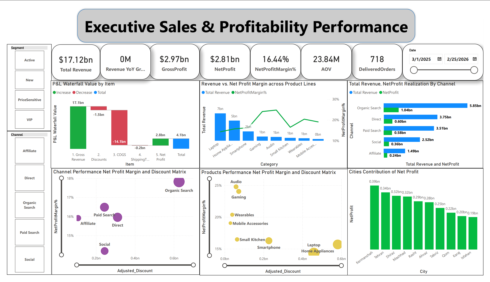
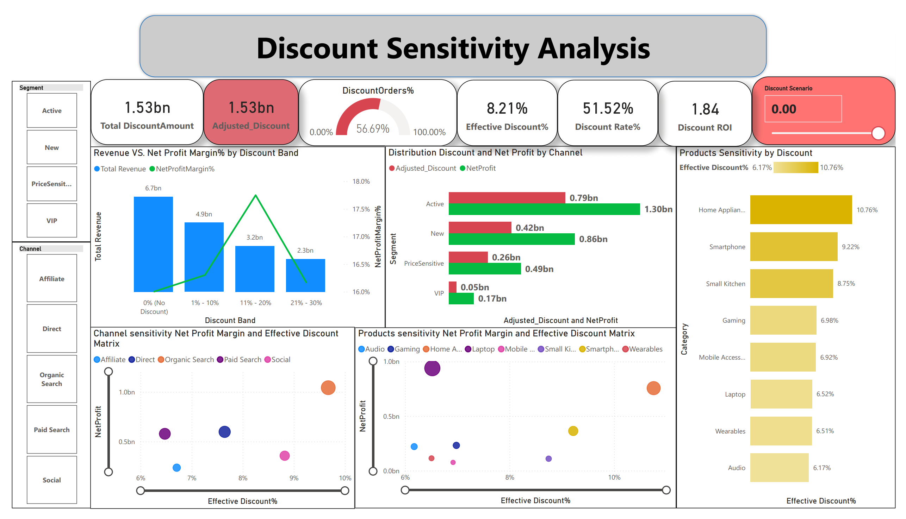

# Retail-Profitability-PowerBI
Power BI Project: Retail Profitability &amp; Discount Sensitivity Analytics
# 📊 Financial Performance & Discount Sensitivity Dashboard

[](https://powerbi.microsoft.com/)
[](./Retail_Profitability_Case_Study.pdf)
[](./PowerBI_final_Project.pbix)

---

## 🎯 Executive Summary & Problem Statement
In fast-scaling retail operations, aggressive discounting is frequently deployed to drive top-line revenue at the direct expense of operating profit. 

Analyzing **$2.81B in Total Revenue** across **March 2025 – February 2026**, this decision-support solution addresses a core operational risk: **56.69% of all orders are sold under promotional discounts**, resulting in severe margin erosion across critical channels and product segments.

This end-to-end Power BI analytics project equips executive leadership, pricing teams, and category managers with granular diagnostic tools to shift commercial strategy from indiscriminate, blanket promotions to targeted, elasticity-driven discount thresholds.

---

## 📑 Detailed Business Case Study
A comprehensive 4-page diagnostic report—detailing financial waterfall reconciliations, elasticity inflection curves, DAX architectures, and strategic recommendations—is fully documented here:

👉 **[Download Full Business Case Study (PDF)](./Retail_Profitability_Case_Study.pdf)**

---

## 🖥️ Dashboard Visual Previews

### Page 1: Executive Performance & P&L Overview
*High-level financial scorecard tracking **$2.81B Revenue**, **16.44% Net Profit Margin**, P&L Waterfall value bridges, and regional distribution.*



---

### Page 2: Discount Sensitivity & Margin Driver Analytics
*Granular diagnostics analyzing discount penetration (**56.69%**), channel elasticities, category margin inflection points, and SKU-level dispersion.*



---

## 🔍 Key Analytical Findings (from Case Study)

1. **The ~20% Discount Margin Cliff:**
   - Uncontrolled discounting represents the single largest leakage point between gross revenue and net earnings.
   - Above the **~20% discount threshold**, transactional volume expansion ceases to offset price concessions—driving top-line revenue growth while severely depressing net margin.

2. **Channel-Level Discount Cannibalization:**
   - **Direct & Organic Channels:** Exhibit strong baseline conversion and healthy margins with minimal promotional reliance; discounts applied here directly erode margin without generating incremental lift.
   - **Paid & Affiliate Channels:** Demonstrate heavy promotional dependence, frequently operating near net breakeven once full discount costs are factored in.

3. **Category Heterogeneity & The 12% Inversion Point:**
   - High-AOV product categories tolerate strategic discounting to stimulate conversion volume.
   - Conversely, thin-margin baseline categories suffer direct margin decay; for low-margin products, net profitability inverts negatively beyond a **12% discount cap**.

---

## 💡 Strategic Recommendations & Action Matrix
- **Transition from Blanket to Tiered Discounts:** Enforce minimum basket-value thresholds (AOV gates) and eliminate universal cart coupons on organic channels.
- **Category-Specific Caps:** Enforce an algorithmic **12% cap** on thin-margin categories; substitute deep price cuts with volume-based bundling.
- **Implement Discount Action Matrix:** Dynamically segment the product portfolio across four strategic quadrants:
  - **Growth Stars** (High Margin, High Volume)
  - **Profit Engines** (High Margin, Lower Volume)
  - **Volume Drivers** (Moderate Margin, High Elasticity)
  - **Profit Traps** (Thin Margin, High Discount Dependency — Immediate rationalization required).
- **Margin Drift Monitoring:** Establish weekly governance tracking `Margin Gap` against target KPI thresholds.

---

## 🛠️ Data Model & DAX Engineering
- **Architecture:** Optimized Star-Schema linking `Fact_Orders` to dimension tables (`Dim_Products`, `Dim_Customers`, `Dim_Channel`, `Dim_Calendar`, and `Dim_PL_Structure`).
- **Core DAX Measures:**
  - `Total Revenue`, `Net Profit`, and `Net Profit Margin %`
  - `Adjusted_Discount` & `Effective Discount %`
  - `DiscountOrders %` (Tracking promotional order penetration)
  - `Discount ROI` & Dynamic `P&L Waterfall Value` calculations using robust `VAR / RETURN` and `DIVIDE` structures.

---

## 📥 How to Explore the Project
1. **Clone or Download the Repository:**
```bash
   git clone https://github.com/<YOUR_GITHUB_USERNAME>/<YOUR_REPOSITORY_NAME>.git
   

USERNAME>/<YOUR_REPOSITORY_NAME>.git
   
